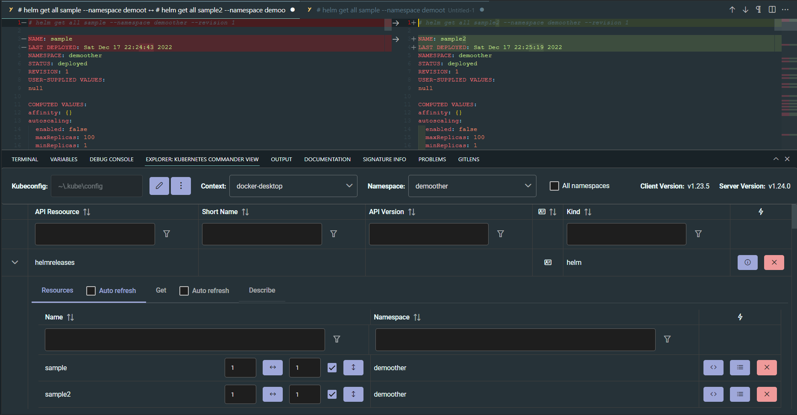

# Kubernets Commander view based on VSCode Webview (DEPRECATED)


**DEPRECATED: You are strongly encouraged to use editor based [Kubernetes Commander (in editor)](https://marketplace.visualstudio.com/items?itemName=sandipchitale.vscode-kubernetes-commander-editor) instead. There are many new features in that extension.**



# What is new

Uses a dedicated ```Kubernetes Commander``` view container in panel.

Use the VSCode extension [Kubernetes Api Resources in Clusters Explorer](https://www.youtube.com/watch?v=x3aqWJO4Rso) to show the API Resources in Cluster Explorer view. It allows drilling down into the API Resource and explain each API Resource and its field using ```kubectl explain```.

## Helm

- Helm releases as resource type
- Compare revisions of different releases (choose one of manifest, values, notes, hooks, templates, all)
- Compare two diffrent revisions of same release (choose one of manifest, values, notes, hooks, templates, all)

## Kubernetes

- Deletion/Uninstall of all resources of a type in a snamespace
- Deletion of a single resource

## Development

This project was generated with `Angular CLI`, so it can be be used for angular development by default.

To test this extension in vscode context:
```
$ yarn install
$ yarn run build
```

After build process you can press F5 to "Start Debugging" (or: select in menu "Debug" -> "Start Debugging"). A new window will open in which you need to open command palette (Ctrl/Cmd + Shift + P).

## Packaging

To generate extension in `VSIX` format execute the package command:

```
yarn run package
```

Finally the generated VSIX file with VSCode extension should appear in the root folder of your project.

# Acknowledgements

Project was inspired by:

https://github.com/4gray/vscode-webview-angular
